# GRC102 Week 4 Practical Laboratory
## Linux Security Monitoring and Auditing: From Technical Evidence to Governance Assurance

**Institution:** International Cybersecurity and Digital Forensics Academy (ICDFA)  
**Course:** GRC102, Information Security Governance  
**Module:** Module 4, Monitoring and Auditing Security Controls  
**Week:** Week 4  
**Student:** Adaeze Elizabeth Adeteye  
**Student ID:** C11/26/CGRCE/17561

---

## Table of Contents

1. [Executive Summary](#1-executive-summary)
2. [Scope, Authorisation and Environment](#2-scope-authorisation-and-environment)
3. [Methodology](#3-methodology)
4. [Evidence Bundle 1: auditd Configuration and Events](#4-evidence-bundle-1-auditd-configuration-and-events)
5. [Evidence Bundle 2: Linux Log Analysis](#5-evidence-bundle-2-linux-log-analysis)
6. [Evidence Bundle 3: Lynis Security Assessment](#6-evidence-bundle-3-lynis-security-assessment)
7. [Evidence Bundle 4: Control Monitoring and Governance](#7-evidence-bundle-4-control-monitoring-and-governance)
8. [Governance Escalation Questions](#8-governance-escalation-questions)
9. [Evidence Bundle 5: SIEM and Automation Mapping](#9-evidence-bundle-5-siem-and-automation-mapping)
10. [Final Audit Findings](#10-final-audit-findings)
11. [Remediation and Retest Plan](#11-remediation-and-retest-plan)
12. [Risk and Priority Model](#12-risk-and-priority-model)
13. [Lessons Learned](#13-lessons-learned)
14. [Conclusion](#14-conclusion)
15. [Rubric Compliance Matrix](#15-rubric-compliance-matrix)
16. [Evidence Quality and Limitations](#16-evidence-quality-and-limitations)
17. [Evidence Index](#17-evidence-index)
18. [Repository Structure](#18-repository-structure)

---

## 1. Executive Summary

This laboratory assessed the security-monitoring and audit posture of an authorised Linux virtual machine. I used `auditd`, `ausearch`, `aureport`, `journalctl` and Lynis to collect technical evidence, then translated the results into governance-focused control monitoring.

**What the evidence shows**

* The audit service was installed, started, enabled and running (Evidence 01).
* Five custom audit rules were written and confirmed as loaded (Evidence 02, 03).
* Audit searches returned program-execution records and `/etc/passwd` activity under the `passwd_changes` key (Evidence 05, 06).
* The failed-event report for 2 October 2026 recorded **0 failed logins and 0 failed authentications**, with **2 failed syscalls** across 15 events (Evidence 08).
* The journal showed routine system and `sudo` activity alongside repeated VirtualBox/X11 shared-clipboard errors, which I treated as operational conditions rather than security incidents (Evidence 09, 10).
* Lynis 3.1.7 identified hardening opportunities, including an unencrypted root filesystem, no boot password protection, UEFI disabled, `fail2ban` and other packages not installed, and USB and filesystem hardening gaps (Evidence 12 to 14).
* As a low-risk improvement, I installed and enabled UFW and confirmed it reported active (Evidence 15).

**Overall conclusion:** the VM has a working monitoring foundation, but the evidence also shows hardening gaps, authentication evidence that needs stronger validation, and no central collection of logs. The key governance action is to assign each finding to an accountable owner, set a threshold or SLA, remediate, and retain retest evidence.

> **Evidence integrity note:** The screenshots are the source of truth for this report. Where a value is not visible in them (for example the final Lynis hardening index), the report says so instead of estimating it.

---

## 2. Scope, Authorisation and Environment

### 2.1 Scope

* Audit-service status and configuration
* Audit rules for sensitive files and program execution
* Audit-event searching and reporting
* System journal review, including privileged-use (`sudo`) activity and error conditions
* Lynis security assessment
* One low-risk firewall hardening action (UFW)
* Governance mapping, control ownership, remediation and retesting
* Conceptual SIEM and continuous control monitoring integration

### 2.2 Authorisation

All activity was performed on the assigned ICDFA training VM. No external, production or unauthorised systems were targeted.

### 2.3 Lab Environment

| Item | Observed value | Source |
| ---- | -------------- | ------ |
| Operating system | Kali Linux (rolling release) | Evidence 12 |
| Hostname | `icdfa` | Evidence 01, 12 |
| Architecture | `x86_64` | Evidence 12 |
| Kernel | `6.12.13` | Evidence 12 |
| Virtualisation | Oracle VirtualBox | Evidence 02 |
| Audit framework | auditd 4.1.2 | Evidence 01 |
| Lynis | 3.1.7 | Evidence 12 |
| Evidence date | Friday 2 October 2026 (WAT) | Evidence 01, 08 |

The assignment suggested Ubuntu, but the screenshots show Kali Linux. I therefore documented the actual environment instead of presenting it as Ubuntu.

---

## 3. Methodology

```text
Configure → Generate activity → Collect evidence → Interpret → Map to controls → Remediate → Retest
```

1. **Audit configuration and evidence collection:** verify `auditd`, write and load rules, generate benign events, query with `ausearch`, summarise with `aureport`.
2. **Log analysis:** review the journal with `journalctl`, observe live events with `journalctl -f`, separate routine activity from conditions that need review.
3. **Security assessment:** run Lynis, review its results, prioritise findings, apply one low-risk remediation (UFW).
4. **Governance assurance:** map evidence to control objectives, assign owners, define thresholds and escalation, and set remediation and retest evidence.

---

## 4. Evidence Bundle 1: auditd Configuration and Events

### 4.1 Auditd service verification

**Evidence 01: installation and service status**

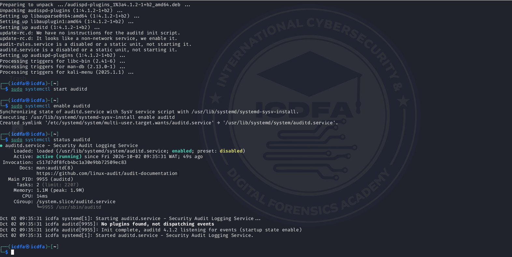

The screenshot shows the audit packages being set up, then `sudo systemctl start auditd`, `sudo systemctl enable auditd` and `sudo systemctl status auditd`. The service is **loaded, enabled and active (running)** since 09:35:31 WAT on 2 October 2026, with the log line "auditd 4.1.2 listening for events".

**Governance interpretation:** an active audit service is a foundational detective control. If it stops, the evidence needed for investigation, accountability and compliance is lost.
**Control objective:** maintain reliable security-event collection on the Linux workload.
**Status:** effective in the captured environment.

### 4.2 Custom audit rules

**Evidence 02: rules configured in `/etc/audit/rules.d/custom.rules`**

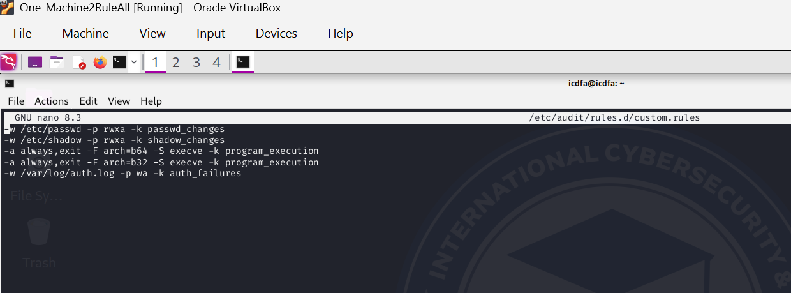

```text
-w /etc/passwd -p rwxa -k passwd_changes
-w /etc/shadow -p rwxa -k shadow_changes
-a always,exit -F arch=b64 -S execve -k program_execution
-a always,exit -F arch=b32 -S execve -k program_execution
-w /var/log/auth.log -p wa -k auth_failures
```

| Rule | Purpose |
| ---- | ------- |
| `/etc/passwd` (read, write, execute, attribute) | Monitor access to account information |
| `/etc/shadow` (read, write, execute, attribute) | Monitor access to password hashes |
| `execve` (64-bit and 32-bit) | Record program execution |
| `/var/log/auth.log` (write, attribute) | Watch the authentication log file |

> **Design note:** the `auth_failures` rule watches *writes to the file* `/var/log/auth.log`. It does not record failed logins. Failed authentication has to be read from the log contents or the journal (see Section 5.3).

### 4.3 Loaded rules

**Evidence 03: `auditctl -l`**

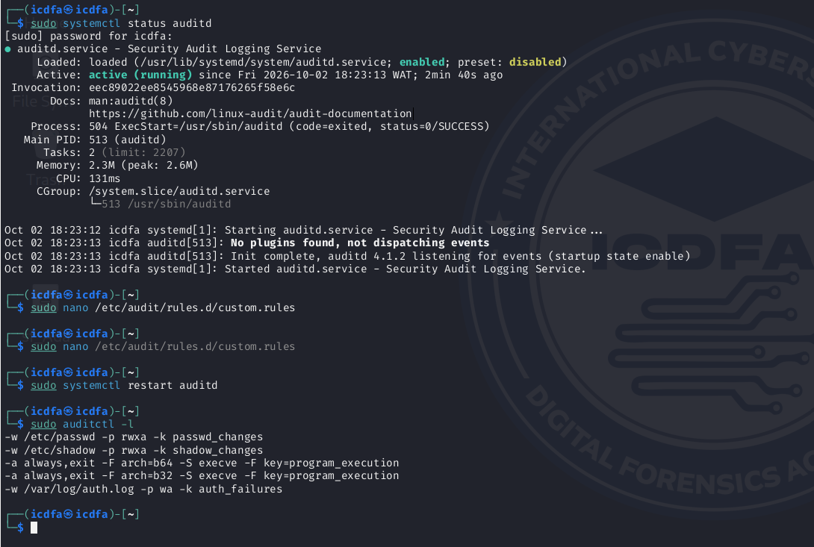

The output confirms the rules were loaded into the audit subsystem. A rule in a file is not assurance that the control is active; the loaded-rule listing is.

### 4.4 Benign event generation

**Evidence 04: controlled activity**

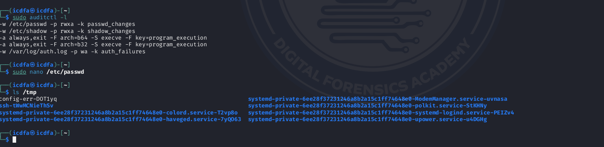

The screenshot shows the rule check, a controlled interaction with `/etc/passwd` through `nano` (exited without saving), and normal `ls /tmp` activity. This proves event-generation activity only; it does not show that account data was changed.

### 4.5 Program execution monitoring

**Evidence 05: `ausearch -k program_execution`**

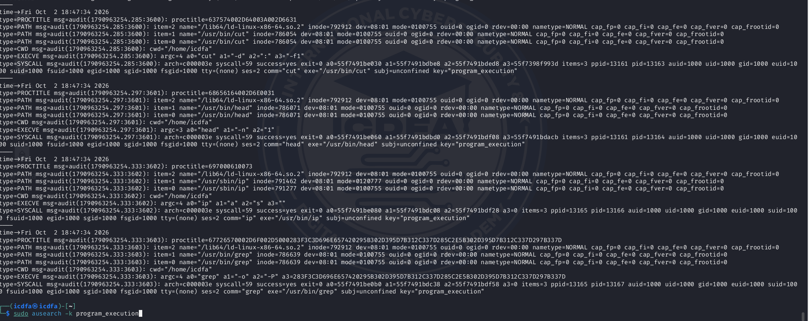

The results contain execution records for commands such as `cut`, `head`, `ip` and `grep`, with executable, user and session fields. Program-execution auditing supports accountability and lets investigators reconstruct activity when a suspicious process or privileged action needs review.

### 4.6 `/etc/passwd` access monitoring

**Evidence 06: `ausearch -k passwd_changes`**

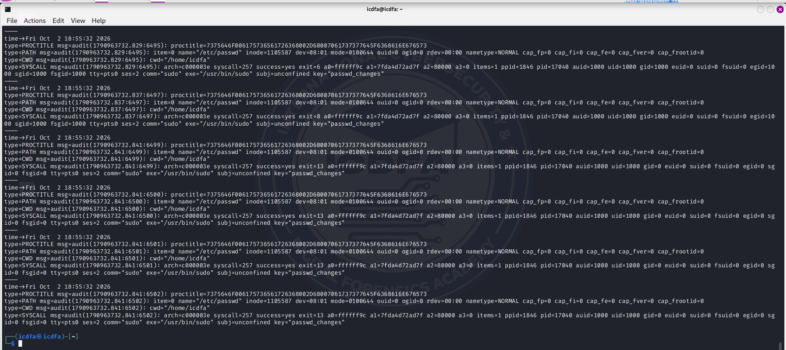

The output shows audit records tied to `/etc/passwd` under the `passwd_changes` key, including activity by `sudo` (a `sudo` syscall record with this key is also visible at the top of Evidence 07). This proves **monitored access** to a sensitive file. It does **not** prove the file contents were modified.

### 4.7 Authentication-related audit key query

**Evidence 07: `ausearch -k auth_failures`**

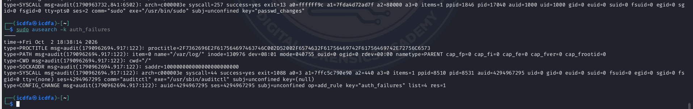

The query returned one record dated Friday 2 October 2026 at 18:38:14. It is a `CONFIG_CHANGE` event (`op=add_rule key="auth_failures"`) generated by `auditctl`, which is the rule being added. It is **not** a failed login or failed authentication. A key match has to be read from the event type and fields, not from the key name.

### 4.8 Audit summary

**Evidence 08: `aureport --failed`**

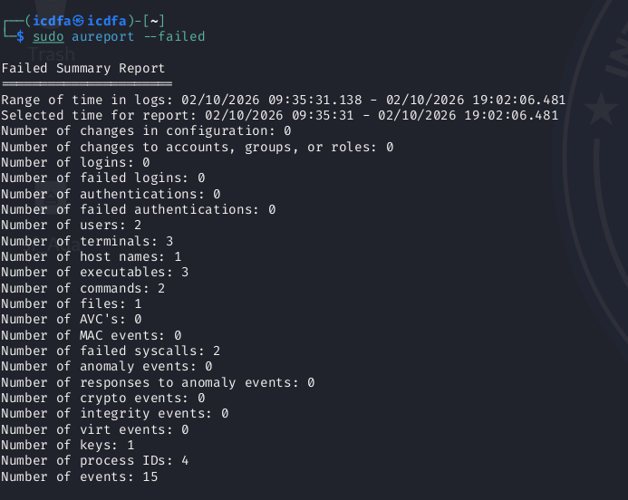

Report period: 02/10/2026 09:35:31 to 19:02:06.

| Metric | Observed |
| ------ | -------: |
| Logins / failed logins | 0 / 0 |
| Authentications / failed authentications | 0 / 0 |
| Changes to configuration | 0 |
| Changes to accounts, groups or roles | 0 |
| Failed syscalls | 2 |
| Anomaly events | 0 |
| Users / terminals / host names | 2 / 3 / 1 |
| Executables / commands / files / keys | 3 / 2 / 1 / 1 |
| Process IDs | 4 |
| **Total events** | **15** |

No failed logins or authentications appear in the report period. The two failed syscalls are audit evidence that needs context, not automatically a security incident.

**Auditd conclusion:** the audit control is operationally present and producing evidence. The assurance opportunities are to keep the rules loaded, validate authentication activity separately, and forward audit evidence to a central platform.

---

## 5. Evidence Bundle 2: Linux Log Analysis

### 5.1 System journal review

**Evidence 09: journal output**

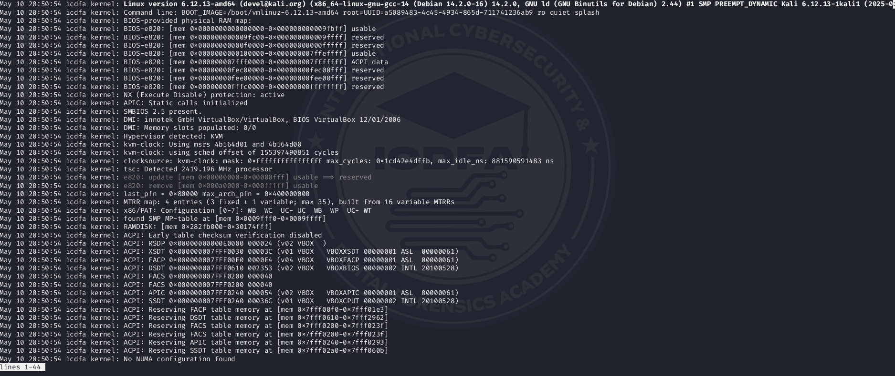

The journal shows kernel, boot, hardware and VirtualBox-related events. Most entries are routine operational information and are not security incidents on their own.

### 5.2 Live journal monitoring

**Evidence 10: `journalctl -f`**

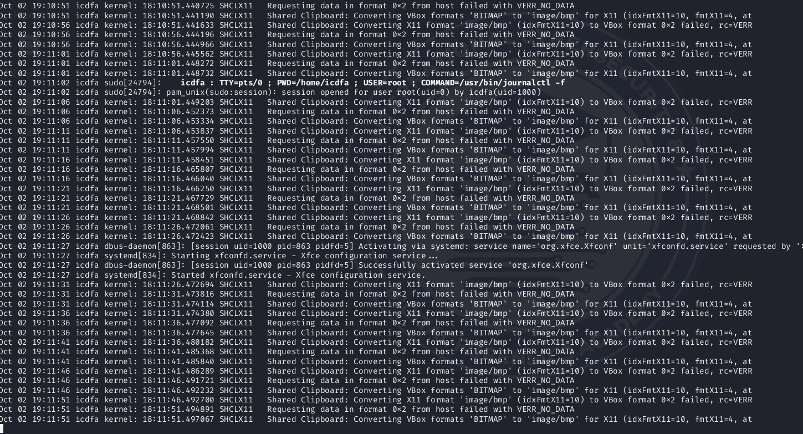

The live journal shows service and session activity and repeated VirtualBox/X11 shared-clipboard error messages.

* The `sudo` session entries show that **privileged use is visible** in the journal.
* The clipboard errors are operational, not confirmed security incidents. If persistent, they should be reviewed because they affect the host/guest boundary and system reliability.

### 5.3 Authentication and privilege-use analysis

The evidence supports a cautious conclusion:

* `aureport --failed` shows **0 failed logins** and **0 failed authentications** (Evidence 08).
* The journal shows normal `sudo` session activity (Evidence 10).
* Evidence 07 is a rule-add event and must not be read as a failed authentication.
* None of the screenshots shows a compromise or a confirmed failed-authentication attack.

Authentication monitoring is therefore present but only partly evidenced. A dedicated `auth.log` or journal query would strengthen it (Section 17).

### 5.4 Event and condition register

| Event / condition | Evidence | Security significance | Recommended action |
| ----------------- | -------- | --------------------- | ------------------ |
| Audit service active | 01 | Supports security-event collection | Monitor service health |
| Program execution records | 05 | Supports accountability | Forward high-risk events to SIEM |
| `/etc/passwd` activity under `passwd_changes` | 06 | Sensitive account-file activity | Investigate unexpected access |
| Failed logins and authentications = 0 | 08 | No confirmed failed login in report period | Continue monitoring |
| `sudo` session activity | 10 | Privileged-use visibility | Correlate with authorised admin activity |
| VirtualBox/X11 clipboard errors | 10 | Operational; possible host/guest boundary concern | Review if persistent or unnecessary |
| Lynis hardening gaps | 13, 14 | Control weaknesses | Prioritise and track remediation |
| UFW installed and enabled | 15 | Adds host-level network filtering | Verify and document the rule set |

---

## 6. Evidence Bundle 3: Lynis Security Assessment

### 6.1 Lynis environment

**Evidence 11: working environment**

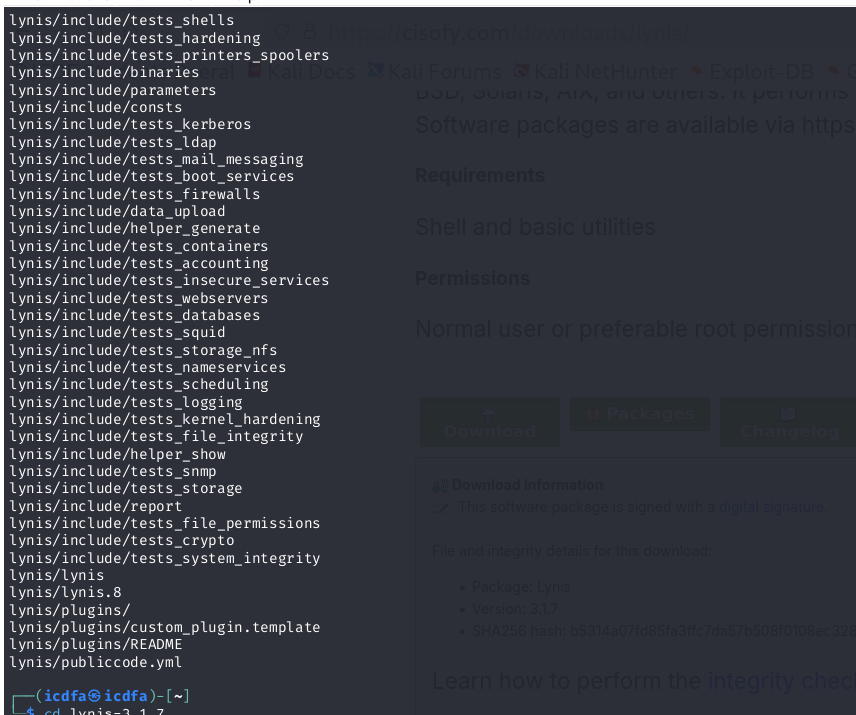

The screenshot shows the Lynis working directory and files used for the assessment.

### 6.2 Audit execution

**Evidence 12: `lynis audit system`**

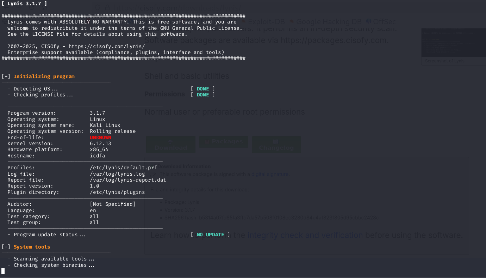

| Item | Observed |
| ---- | -------- |
| Lynis version | 3.1.7 |
| Operating system | Kali Linux, rolling release |
| Kernel / platform / hostname | 6.12.13 / x86_64 / `icdfa` |
| Test category and group | all / all |
| Log file | `/var/log/lynis.log` |
| Report file | `/var/log/lynis-report.dat` |
| End-of-life status | UNKNOWN (rolling release) |

### 6.3 Lynis results

**Evidence 13: Debian, authentication, encryption, boot and services checks**

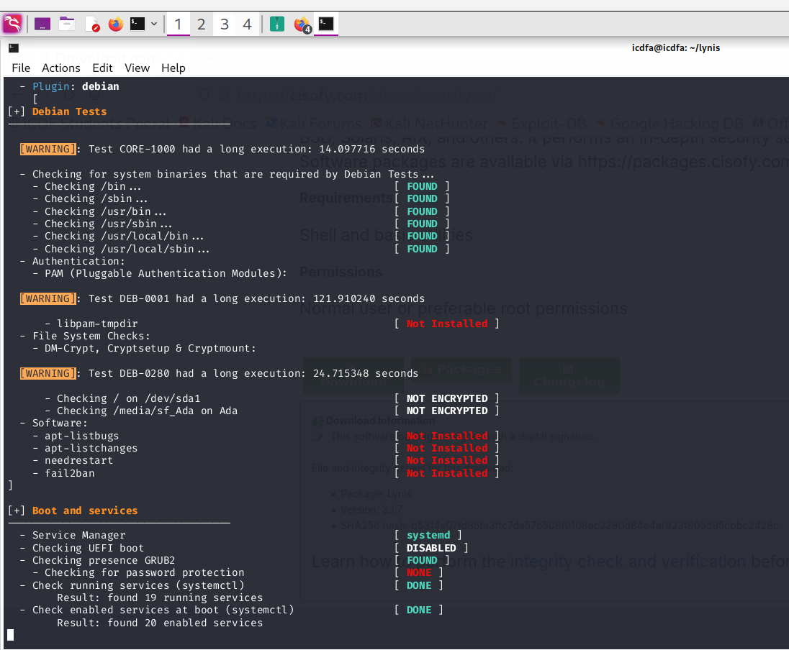

> **Reading the `[WARNING]` lines correctly:** the four `[WARNING]` messages visible across Evidence 13 and 14 are Lynis **performance notices** ("Test ... had a long execution"), for example CORE-1000 (14.1 s), DEB-0001 (121.9 s), DEB-0280 (24.7 s) and PKGS-7345 (62.9 s). They are not security warnings. The security-relevant findings are the individual check results below.

| Area | Check result observed |
| ---- | --------------------- |
| PAM | `libpam-tmpdir` **Not Installed** |
| Encryption | `/` on `/dev/sda1` **NOT ENCRYPTED**; `/media/sf_Ada` (shared folder) **NOT ENCRYPTED** |
| Software | `apt-listbugs`, `apt-listchanges`, `needrestart`, `fail2ban` **Not Installed** |
| Boot | UEFI boot **DISABLED**; GRUB2 found; password protection **NONE** |
| Services | 19 running services and 20 enabled services found |

**Evidence 14: filesystem, USB, storage, name services and packages**

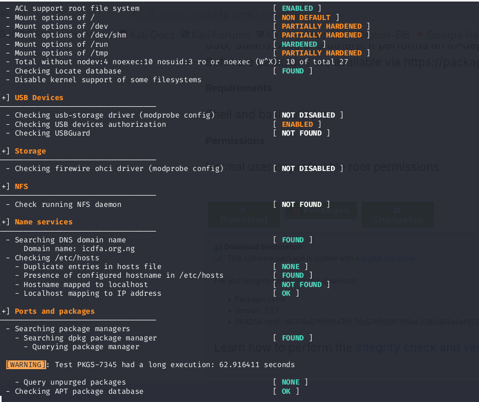

| Area | Check result observed |
| ---- | --------------------- |
| Mount options | `/` NON DEFAULT; `/dev`, `/dev/shm`, `/tmp` PARTIALLY HARDENED; `/run` HARDENED |
| ACL support | Root filesystem ENABLED |
| USB | `usb-storage` driver NOT DISABLED; USB authorisation ENABLED; USBGuard NOT FOUND |
| Storage | FireWire OHCI driver NOT DISABLED |
| NFS | No NFS daemon found |
| Name services | Domain name found (`icdfa.org.ng`); no duplicate `/etc/hosts` entries |
| Packages | dpkg found; APT package database OK |

These are **hardening observations**, not all confirmed vulnerabilities.

### 6.4 Prioritised recommendations

| Priority | Finding | Governance risk | Recommended action | Owner |
| -------- | ------- | --------------- | ------------------ | ----- |
| High | Root filesystem not encrypted | Data exposed if storage is compromised | Assess feasibility and document an approved storage-protection standard | System Administrator / Security |
| High | No boot password protection; UEFI disabled | A local attacker could alter boot parameters | Review GRUB and boot protection against system requirements | System Administrator |
| High | `fail2ban` not installed | Weaker automated response to repeated abusive logins | Decide whether exposed services need brute-force protection, then deploy | System Administrator |
| Moderate | Shared-folder encryption not enabled | Host/guest data-boundary exposure | Review whether the shared folder is needed and how it is protected | Lab Administrator |
| Moderate | Extra services and packages (19 running, 20 enabled) | Larger attack surface and maintenance burden | Review and disable or remove unnecessary components | System Administrator |
| Moderate | USB, FireWire and filesystem hardening gaps | Peripheral and mount-option exposure | Assess and apply approved restrictions | Security / System Administrator |

### 6.5 Hardening index limitation

The supplied screenshots do **not** show the final Lynis summary, so the hardening index, warning count and suggestion count are not reported and no score is estimated. Section 17 lists the one capture that would close this gap.

### 6.6 UFW remediation

**Evidence 15: UFW installed and enabled**

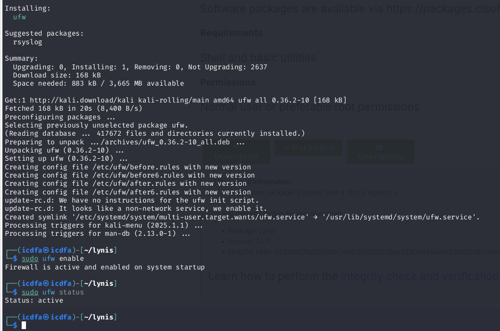

The screenshot shows UFW 0.36.2-10 being **installed** (it was not previously present), then `sudo ufw enable` returning "Firewall is active and enabled on system startup", and `sudo ufw status` returning `Status: active`.

This is a useful low-risk hardening action because it adds a host-level network control layer. The detailed rule set and default policy are not visible, so rule-level effectiveness is **not claimed**. Retest evidence should come from `sudo ufw status verbose`.

---

## 7. Evidence Bundle 4: Control Monitoring and Governance

### 7.1 Control-monitoring table

| Control / objective | Evidence | Owner | Observed status | KPI / KRI or threshold | Risk if it fails | Remediation | Retest |
| ------------------- | -------- | ----- | --------------- | ---------------------- | ---------------- | ----------- | ------ |
| Audit service availability | 01 | System Administrator | **Effective** | auditd active at all times | Audit evidence lost if stopped | Monitor service health | `systemctl is-active auditd` |
| Sensitive account-file monitoring | 02, 03, 06 | System Administrator / Security | **Implemented** | 100% of required rules loaded | Account-file activity goes undetected | Maintain `/etc/passwd` and `/etc/shadow` rules | `auditctl -l`, `ausearch` |
| Program-execution accountability | 02, 05 | Security Operations | **Implemented** | Required execution rules loaded | Suspicious execution cannot be investigated | Forward high-value events to SIEM | Run a benign test command and search for it |
| Authentication monitoring | 02, 07, 08 | Security Operations | **Partially evidenced** | Investigate failed-authentication spikes above threshold | Attacks missed if log coverage is incomplete | Validate auth-log and journal monitoring | Capture a dedicated authentication query |
| Privileged-use monitoring | 08, 10 | System Administrator / Security | **Operational** | Review privileged events outside approved activity | Misuse of administrative access | Correlate `sudo` events with authorised work | Sample and review privileged sessions |
| Linux hardening | 13, 14 | System Administrator | **Needs improvement** | High-priority findings tracked to closure | Larger attack surface | Prioritise encryption, boot, services and authentication controls | Re-run Lynis |
| Host firewall | 15 | System Administrator | **Implemented** | Firewall active continuously | Unnecessary network exposure | Maintain the approved firewall policy | `ufw status verbose` |
| Continuous control monitoring | 01 to 15 and SIEM model | Security Governance / SOC | **Partially implemented** | High-risk exceptions escalated within SLA | Local-only evidence delays detection | Centralise audit, log and Lynis evidence | Test SIEM ingestion and alerting |

### 7.2 Evidence-backed governance findings

**W4-F01: Linux hardening gaps** (Priority: High)
*Evidence:* 13, 14. *Risk:* configuration weaknesses increase attack surface and reduce resilience. *Owner:* System Administrator with Security/GRC oversight. *Action:* create a remediation tracker, prioritise high-impact items, document exceptions and retest.

**W4-F02: Authentication evidence needs stronger validation** (Priority: Moderate)
*Evidence:* 07, 08. *Risk:* the `auth_failures` query returned a rule-add event, and no dedicated failed-password query is in the screenshots. *Owner:* Security Operations / System Administrator. *Action:* capture a dedicated authentication query and define a threshold for repeated failures.

**W4-F03: Local audit evidence should feed central monitoring** (Priority: Moderate)
*Evidence:* 01 to 10. *Risk:* host-only evidence can be lost, overlooked or reviewed too late. *Owner:* Security Operations / GRC. *Action:* forward audit and journal events to a SIEM or central assurance store with alert and escalation rules.

**W4-F04: UFW rule-level evidence is incomplete** (Priority: Moderate)
*Evidence:* 15. *Risk:* activation is shown, but the rule set and default policy are not. *Owner:* System Administrator. *Action:* capture `sudo ufw status verbose` and compare it with the approved baseline.

**W4-F05: The `auth_failures` rule does not record failed logins** (Priority: Moderate)
*Evidence:* 02, 07. *Risk:* the rule watches writes to `/var/log/auth.log`, so its key name may give a false sense of authentication coverage. *Owner:* Security Operations. *Action:* rename or document the rule's real purpose, and monitor authentication events from log content or the journal.

---

## 8. Governance Escalation Questions

### 8.1 Highest-priority finding

The highest priority is the group of **Lynis hardening findings**, especially the unencrypted root filesystem and the lack of boot protection. They are persistent weaknesses rather than isolated events, so they stay exploitable until they are remediated or formally accepted as risk.

### 8.2 Remediation ownership

| Issue | Primary owner | Oversight |
| ----- | ------------- | --------- |
| auditd availability and rules | System Administrator | Security / GRC |
| Authentication monitoring | Security Operations | CISO / Risk |
| Hardening findings | System Administrator | Security / GRC |
| Firewall policy | System Administrator | Security |
| Central monitoring / SIEM | Security Operations | CISO / GRC |
| Risk acceptance and exceptions | Risk Owner | Management / Risk Committee |

### 8.3 Escalation thresholds

Escalate when:

* auditd stops or required rules are missing;
* confirmed failed authentications exceed the approved threshold;
* unexpected privileged activity is detected;
* high-priority Lynis findings are overdue;
* a critical control cannot produce its required evidence;
* the firewall is disabled or departs materially from the approved baseline;
* remediation exceeds its SLA without an approved exception.

### 8.4 Evidence of successful remediation

* `systemctl status auditd` showing active
* `auditctl -l` showing the required rules
* `ausearch` returning the expected events
* authentication queries showing expected coverage
* Lynis showing the selected finding resolved or improved
* `ufw status verbose` showing the approved policy
* SIEM evidence of successful ingestion and alerting

### 8.5 Retesting

Controls should be retested after remediation and then periodically. For high-risk findings, retesting has two parts: **technical verification** that the configuration changed as intended, and **evidence verification** that the control can still produce reliable evidence.

---

## 9. Evidence Bundle 5: SIEM and Automation Mapping

### 9.1 Proposed monitoring architecture

```text
Linux evidence sources
(auditd, journalctl, logs, Lynis, UFW state)
            |
            v
Central collection / forwarding
            |
            v
SIEM / assurance data store
            |
            v
Normalisation and correlation
            |
            v
Analytics and exception detection
            |
     +------+------+
     |             |
     v             v
Technical     Governance
alert         exception
     |             |
     v             v
SOC /         Security / GRC /
administrator Risk
     |             |
     +------+------+
            |
            v
Remediation workflow → Retesting → Management reporting
```

### 9.2 Evidence-to-SIEM mapping

| Linux evidence | SIEM use | Example rule | Governance escalation |
| -------------- | -------- | ------------ | --------------------- |
| auditd program execution | Process accountability | Unusual privileged execution | Escalate if unauthorised |
| `/etc/passwd` access | Account-file monitoring | Sensitive-file access outside an approved process | Security investigation |
| `/etc/shadow` access | Credential protection | Any unexpected access | Immediate security review |
| Authentication events | Identity monitoring | Repeated failed authentication | Escalate when threshold exceeded |
| `sudo` activity | Privileged access monitoring | Privileged action outside change window | Owner / CISO review |
| Journal errors | Operational and security monitoring | Repeated critical service errors | Service owner review |
| Lynis findings | Continuous assurance | High-risk finding overdue | GRC / Risk escalation |
| UFW state | Configuration monitoring | Firewall disabled | Immediate alert and escalation |

### 9.3 Automation opportunities

Automation can collect audit and journal evidence continuously, normalise events, detect threshold breaches, create and assign tickets, notify risk owners when SLAs are breached, compare configurations with baselines, trigger retests after remediation, and feed management dashboards. This turns point-in-time checks into **continuous control monitoring**.

---

## 10. Final Audit Findings

| ID | Finding | Evidence | Priority | Status |
| -- | ------- | -------- | -------- | ------ |
| W4-F01 | Linux hardening gaps identified | 13, 14 | High | Open |
| W4-F02 | Authentication evidence needs dedicated validation | 07, 08 | Moderate | Open |
| W4-F03 | Central monitoring / SIEM integration needed | 01 to 10 | Moderate | Open |
| W4-F04 | Firewall rule-level evidence incomplete | 15 | Moderate | Open |
| W4-F05 | `auth_failures` rule watches the log file, not failed logins | 02, 07 | Moderate | Open |
| W4-P01 | auditd and core audit rules operational | 01 to 03 | Positive control | Effective |
| W4-P02 | Program-execution auditing producing evidence | 05 | Positive control | Effective |
| W4-P03 | No failed logins or authentications in `aureport` | 08 | Positive observation | Monitored |
| W4-P04 | UFW installed and enabled at startup | 15 | Positive control | Implemented |

---

## 11. Remediation and Retest Plan

| Finding | Remediation | Owner | Target evidence | Retest |
| ------- | ----------- | ----- | --------------- | ------ |
| W4-F01 | Prioritise Lynis hardening findings | System Administrator | Updated configuration and Lynis result | Re-run Lynis |
| W4-F02 | Validate authentication log monitoring | Security Operations | Auth-log or journal query | Repeat query and confirm expected events |
| W4-F03 | Centralise audit and journal evidence | Security Operations | SIEM ingestion or dashboard | Generate a test event |
| W4-F04 | Verify UFW policy | System Administrator | `ufw status verbose` | Compare with baseline |
| W4-F05 | Clarify or replace the `auth_failures` rule | Security Operations | Updated rule file and `auditctl -l` | Reload rules and re-query |
| W4-P01 | Maintain auditd rules | System Administrator | `auditctl -l` | Periodic control test |
| W4-P02 | Maintain execution monitoring | Security Operations | `ausearch` evidence | Run a benign test command |
| W4-P03 | Continue failed-authentication monitoring | Security Operations | `aureport` and auth logs | Periodic review |
| W4-P04 | Maintain firewall startup state | System Administrator | UFW status | Re-check after reboot where permitted |

---

## 12. Risk and Priority Model

* **Critical:** immediate threat to confidentiality, integrity or availability; management escalation required.
* **High:** material control weakness or significant exposure needing prioritised remediation.
* **Moderate:** weakness needing planned remediation and monitoring.
* **Low:** improvement opportunity with limited immediate risk.

No finding was rated Critical, because the screenshots do not show an active compromise.

---

## 13. Lessons Learned

Security monitoring is more than collecting logs; evidence has to be interpreted correctly before it supports a governance decision.

* **An audit key is not the meaning of an event.** The `auth_failures` query returned a rule-add event, not a failed login.
* **An access record is not a change record.** `/etc/passwd` audit events show monitored access, not modification.
* **Tool output needs careful reading.** Lynis `[WARNING]` lines in my screenshots were performance notices, while the real findings were the check results.
* **Unresolved hardening findings become governance issues.** Each needs an owner, an expected remediation date, retained evidence and a retest.
* **Host-level monitoring should feed a central platform** so events can be correlated, trended and escalated.

---

## 14. Conclusion

The exercise showed a functioning foundation for security assurance. auditd was active with custom rules loaded, events were generated and searchable, the journal gave visibility into system and privileged-use activity, and Lynis identified multiple hardening opportunities that I partly addressed by installing and enabling UFW.

The main governance gap is not missing evidence but the lack of a repeatable control-monitoring process. Each important finding needs an accountable owner, a threshold or SLA, a remediation action and a retest requirement. The next maturity step is to centralise auditd and journal evidence in a SIEM or assurance data store, automate exception detection and connect technical findings to GRC workflows.

---

## 15. Rubric Compliance Matrix

| Rubric criterion | Marks | How this submission addresses it | Evidence / section |
| ---------------- | ----: | -------------------------------- | ------------------ |
| auditd configuration and audit evidence | 20 | Service verification, rules, loaded-rule verification, `ausearch`, `aureport`, interpretation | Sections 4.1 to 4.8; Evidence 01 to 08 |
| Linux log analysis | 20 | Journal review, live monitoring, privileged-use interpretation, event register | Section 5; Evidence 09, 10 |
| Lynis security assessment | 20 | Environment, execution, findings, prioritisation, remediation reasoning, UFW hardening | Section 6; Evidence 11 to 15 |
| Control monitoring and governance mapping | 20 | 8-row monitoring table, 5 governance findings, owners, thresholds, remediation, retesting | Sections 7, 8 |
| SIEM/automation, final report and professionalism | 20 | SIEM architecture, automation mapping, summary, methodology, findings, conclusion | Sections 1, 3, 9 to 14 |
| **Total** | **100** | All rubric areas addressed | |

---

## 16. Evidence Quality and Limitations

1. **Lynis hardening index:** the final index, warning count and suggestion count are not visible in the screenshots, so no score is reported.
2. **Authentication failure evidence:** Evidence 07 is a rule-add event, not a failed login. Evidence 08 shows zero failed logins and authentications for its period.
3. **No dedicated authentication query:** no `failed password` or equivalent journal query appears in the screenshots.
4. **UFW rules:** Evidence 15 proves UFW is installed and active, but not its rule set or default policy.
5. **Distribution:** the screenshots show Kali Linux, not Ubuntu.
6. **Single VM:** results reflect one lab system and are not representative of an enterprise estate. The SIEM material is conceptual.

---

## 17. Recommended Final Evidence Capture

If the VM is still available, three further screenshots would close the remaining gaps:

**A. Final Lynis summary** (hardening index, warnings, suggestions)

```bash
sudo lynis audit system
```

**B. Authentication evidence**

```bash
sudo journalctl | grep -i "failed"
sudo grep -i "failed password" /var/log/auth.log
sudo grep -i "sudo" /var/log/auth.log
```

Kali may not keep `/var/log/auth.log` unless `rsyslog` is installed, so use the journal command if the file is missing.

**C. Detailed firewall state**

```bash
sudo ufw status verbose
```

---

## 18. Evidence Index and Repository Structure

| Evidence | File | Purpose |
| -------- | ---- | ------- |
| E01 | [01-auditd-installation-and-status.png](evidence/01-auditd-installation-and-status.png) | auditd installation and service status |
| E02 | [02-audit-rules-configured.png](evidence/02-audit-rules-configured.png) | Custom audit rules |
| E03 | [03-auditd-rules-verification.png](evidence/03-auditd-rules-verification.png) | Loaded audit rules |
| E04 | [04-audit-event-generation.png](evidence/04-audit-event-generation.png) | Benign event generation |
| E05 | [05-auditd-program-execution.png](evidence/05-auditd-program-execution.png) | Program execution events |
| E06 | [06-auditd-passwd-file-access.png](evidence/06-auditd-passwd-file-access.png) | `/etc/passwd` monitored access |
| E07 | [07-auditd-auth-failures-query.png](evidence/07-auditd-auth-failures-query.png) | `auth_failures` key query |
| E08 | [08-aureport-failed-summary.png](evidence/08-aureport-failed-summary.png) | Failed-event audit summary |
| E09 | [09-journalctl-system-logs.png](evidence/09-journalctl-system-logs.png) | System journal review |
| E10 | [10-journalctl-follow-mode.png](evidence/10-journalctl-follow-mode.png) | Live journal monitoring |
| E11 | [11-lynis-environment.png](evidence/11-lynis-environment.png) | Lynis environment |
| E12 | [12-lynis-audit-scan-start.png](evidence/12-lynis-audit-scan-start.png) | Lynis audit execution |
| E13 | [13-lynis-findings-warnings.png](evidence/13-lynis-findings-warnings.png) | Lynis check results |
| E14 | [14-lynis-hardening-items.png](evidence/14-lynis-hardening-items.png) | Lynis hardening items |
| E15 | [15-ufw-remediation.png](evidence/15-ufw-remediation.png) | UFW installed and enabled |

```text
linux-security-monitoring-auditing/
│
├── README.md
│
└── evidence/
    ├── 01-auditd-installation-and-status.png
    ├── 02-audit-rules-configured.png
    ├── 03-auditd-rules-verification.png
    ├── 04-audit-event-generation.png
    ├── 05-auditd-program-execution.png
    ├── 06-auditd-passwd-file-access.png
    ├── 07-auditd-auth-failures-query.png
    ├── 08-aureport-failed-summary.png
    ├── 09-journalctl-system-logs.png
    ├── 10-journalctl-follow-mode.png
    ├── 11-lynis-environment.png
    ├── 12-lynis-audit-scan-start.png
    ├── 13-lynis-findings-warnings.png
    ├── 14-lynis-hardening-items.png
    └── 15-ufw-remediation.png
```

---

## Final Submission Statement

This repository contains the written control-assurance report and supporting screenshots for the ICDFA GRC102 Week 4 Practical Laboratory. The observations are based on the supplied lab evidence, and evidence limitations are disclosed rather than filled with estimated results. The activity was completed in an authorised training environment.

**Author:** Adaeze Elizabeth Adeteye  
**Student ID:** C11/26/CGRCE/17561  
**Course:** GRC102, Information Security Governance  
**Lab:** Week 4, Linux Security Monitoring and Auditing
