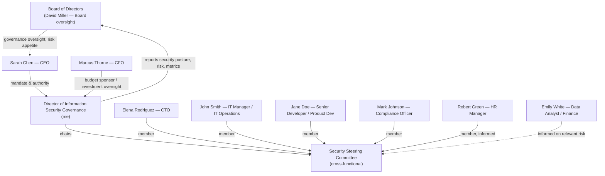

# Task 1: Governance Blueprint

**Prepared by:** Adaeze E Adeteye - Director of Information Security Governance, GlobalHealth Connect (GHC)  
**Executive request:** CEO Sarah Chen has asked for a formal security governance structure with clear roles, reporting relationships and accountability following the recent data-leakage near-miss.

---

## 1. Current-State Governance Gap Assessment

When I stepped into this role, I reviewed GHC's security arrangements against the six governance domains the Board asked me to assess, and I found a pattern I would summarise as "capable people, no system." GHC has grown quickly, two acquisitions plus organic growth but its governance has not grown with it. Below is what I found, and why each gap matters to the business.

| Governance Domain | What I Found | Why This Is a Risk |
|---|---|---|
| **Policy & Documentation** | Policies are inconsistent and largely inherited from the two acquired companies; they are not harmonised or kept current. | Conflicting or stale policies give staff no single source of truth, and they undermine GHC's ability to demonstrate consistent controls to regulators or customers evaluating GHC's patient-data handling. |
| **Roles & Responsibilities** | Security ownership and accountability are unclear across the organisation. | When something goes wrong as it nearly did, no one is unambiguously accountable for the decision, the control, or the response. This is precisely how a "near-miss" becomes an actual breach next time. |
| **Risk Management** | The organisation is reactive; there is no formal, proactive risk assessment process. | GHC is making product, M&A and technology decisions without a structured view of the risk each one introduces. Risk is being discovered after the fact rather than managed in advance. |
| **Metrics & Reporting** | Technical metrics exist (e.g., patching, phishing simulation results) but are not translated into business impact. | The Board and CFO cannot make informed investment or oversight decisions from technical noise. This also means the Board has no early-warning signal, which is exactly why the near-miss caught everyone by surprise. |
| **Training & Awareness** | Annual training is mandatory, but engagement is low. | A workforce that treats training as a compliance checkbox rather than a genuine practice is the most common initial entry point for the kind of incident GHC narrowly avoided. |
| **Compliance** | Compliance preparation is audit-driven rather than continuously monitored. | GHC operates in health technology, where regulatory obligations are ongoing, not annual events. Point-in-time compliance leaves gaps open for months at a time between audits. |

**My overall assessment:** GHC does not lack security effort, it lacks a governance system that connects that effort to accountability, business decision-making and the Board. The near-miss was not bad luck; it was the predictable outcome of an ad-hoc model that has outgrown a mid-sized, multi-acquisition health-technology company handling sensitive patient data.

---

## 2. Proposed Security Governance Organisational Chart

I am proposing a structure that gives information security a clear line to the Board, without disconnecting it from the day-to-day technology and business functions that have to implement it. The Security Steering Committee (detailed in Task 4) is the cross-functional bridge between my office and the business units.

**Key relationships:**
- I report functionally to the CEO for mandate and authority, and **directly to the Board** on security posture, risk and metrics, this closes the gap that let the near-miss go undetected until it nearly escalated.
- The CFO is my budget sponsor and a key oversight stakeholder, since security investment competes with GHC's other strategic priorities.
- The CTO, IT Manager, Compliance Officer, HR Manager and a Development representative sit on the Security Steering Committee, which I chair. This is where cross-functional security decisions (like the password-policy dispute in Task 4) actually get resolved, rather than being escalated straight to the CEO every time.
- Compliance sits on the committee rather than being a separate silo, because in a health-technology business, regulatory and security risk are the same conversation.

---

## 3. RACI Matrix

I have covered seven governance activities — one more than the minimum required because incident response planning and incident response execution are genuinely different accountabilities, and I did not want to blur them.

**Key:** R = Responsible, A = Accountable, C = Consulted, I = Informed

| Governance Activity | Board | CEO | CFO | Director of Info Sec Governance (me) | CTO | IT Manager | Compliance Officer |
|---|---|---|---|---|---|---|---|
| Security policy approval | A | C | C | R | C | I | C |
| Security budget approval | I | A | R | C | C | I | I |
| Enterprise risk review | I | A | C | R | C | C | C |
| Incident response planning | I | C | I | A/R | C | C | C |
| Incident response execution (live incident) | I | I | I | A | R | R | C |
| Security Steering Committee decisions (e.g. password policy) | I | I | I | A | C | R | C |
| Regulatory / compliance reporting | I | C | I | A | I | I | R |

**Note on Incident Response Planning vs. Execution:** I hold both Accountable and Responsible for planning, because the plan itself is a governance artefact I own end-to-end with input from stakeholders. During a * live incident, I remain Accountable for the overall response, but IT Operations and the CTO's team are Responsible for execution, I should not be the one physically containing a breach at 2am, but I am the one who answers for how it was handled.

---

## 4. Governance Rationale

I designed this structure around four things the Board specifically asked for: accountability, transparency, business alignment and risk management.

**Accountability.** Every governance activity in the RACI matrix now has exactly one accountable owner. Under the old ad-hoc model, "security ownership and accountability are unclear"  that ambiguity is precisely what allowed the near-miss to develop without anyone catching it early. A single accountable owner per activity means that if something goes wrong, GHC knows immediately who to ask and who is expected to have already acted.

**Transparency.** By reporting directly to the Board rather than only through the CEO, I remove the risk that security information gets filtered, delayed or softened before it reaches the people with ultimate oversight responsibility. This also gives the Board (through David Miller) the "meaningful metrics" he specifically asked for, addressed in Task 3.

**Business alignment.** The CFO sits close to the security function as budget sponsor, not as an outside auditor of spend after the fact this means investment decisions and risk decisions happen in the same conversation, not two disconnected ones. The Security Steering Committee also exists specifically so that decisions like the password-policy dispute in Task 4 are resolved with business impact (developer productivity, operational friction) and security risk weighed together, rather than security dictating to the business or vice versa.

**Risk management.** Moving enterprise risk review from reactive to a defined, Accountable activity that I own means GHC's risk posture is assessed on an ongoing basis, not rediscovered after an incident. This directly addresses the biggest gap I found in the current-state assessment: an organisation reacting to risk instead of managing it.
