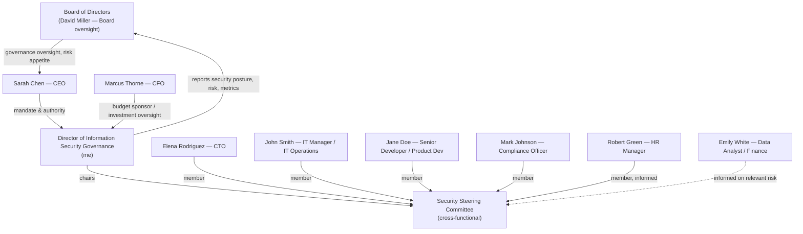

**Course:** GRC102 - Information Security Governance, Module 1 (ICDFA)  
**Lab:** Week 1 Practical Laboratory  
**Prepared by:** Adaeze Elizabeth Adeteye (Registration No: C11_26_CGRCE_17561)  
**Role assumed for this simulation:** Director of Information Security Governance, GlobalHealth Connect (GHC)

---

## Table of Contents

- [Declaration of AI Assistance](#declaration-of-ai-assistance)
- [Task 1 — Governance Blueprint](#task-1--governance-blueprint)
  - [1.1 Current-State Governance Gap Assessment](#11-current-state-governance-gap-assessment)
  - [1.2 Proposed Security Governance Organisational Chart](#12-proposed-security-governance-organisational-chart)
  - [1.3 RACI Matrix](#13-raci-matrix)
  - [1.4 Governance Rationale](#14-governance-rationale)
- [Task 2 — Information Security Charter](#task-2--information-security-charter)
  - [2.1 GHC Information Security Charter](#21-ghc-information-security-charter)
  - [2.2 CFO Justification Memo](#22-cfo-justification-memo)
- [Task 3 — Board Reporting and Security Metrics](#task-3--board-reporting-and-security-metrics)
  - [3.1 Board Executive Summary](#31-board-executive-summary-one-page)
  - [3.2 Five Selected Security Metrics: Trends and Commentary](#32-five-selected-security-metrics-trends-and-commentary)
  - [3.3 Priority Risks and Recommendations](#33-priority-risks-and-recommendations)
  - [3.4 Rationale for Metric Selection](#34-rationale-for-metric-selection)
- [Task 4 — Security Steering Committee](#task-4--security-steering-committee)
  - [4.1 Terms of Reference](#41-security-steering-committee--terms-of-reference)
  - [4.2 Sample First SSC Meeting Agenda](#42-sample-first-ssc-meeting-agenda)
  - [4.3 CEO Briefing Note](#43-ceo-briefing-note)
- [Task 5 — Governance Maturity Assessment](#task-5--governance-maturity-assessment)
  - [5.1 Completed Maturity Assessment](#51-completed-maturity-assessment)
  - [5.2 12–18 Month Maturity Roadmap](#52-1218-month-maturity-roadmap)
  - [5.3 Board Executive Summary — Governance Maturity](#53-board-executive-summary--governance-maturity)
- [References](#references)

---

## Declaration of AI Assistance

In line with the Rules of Engagement for this laboratory, I confirm that AI tools (Claude) were used to support the drafting and structuring of this report-including brainstorming language for governance artefacts, organising content under the required headings, and helping generate the visual diagrams and charts included as evidence.

All analysis, interpretation of the GHC scenario data, governance decisions (including the RACI assignments, the proposed organisational structure, the metric selection and the maturity ratings) and final written content reflect my own review, judgement and verification. I have not fabricated any laws, standards, evidence or metrics beyond what was provided in the assignment brief, and I am able to explain and defend every decision in this report during grading or moderation.

---

## Task 1 - Governance Blueprint

**Prepared by:** Director of Information Security Governance, GlobalHealth Connect (GHC)
**Executive request:** CEO Sarah Chen has asked for a formal security governance structure with clear roles, reporting relationships and accountability following the recent data-leakage near-miss.

### 1.1 Current-State Governance Gap Assessment

When I stepped into this role, I reviewed GHC's security arrangements against the six governance domains the Board asked me to assess, and I found a pattern I would summarise as "capable people, no system." GHC has grown quickly, two acquisitions plus organic growth but its governance has not grown with it. Below is what I found, and why each gap matters to the business.

| Governance Domain | What I Found | Why This Is a Risk |
|---|---|---|
| **Policy & Documentation** | Policies are inconsistent and largely inherited from the two acquired companies; they are not harmonised or kept current. | Conflicting or stale policies give staff no single source of truth, and they undermine GHC's ability to demonstrate consistent controls to regulators or customers evaluating GHC's patient-data handling. |
| **Roles & Responsibilities** | Security ownership and accountability are unclear across the organisation. | When something goes wrong as it nearly did, no one is unambiguously accountable for the decision, the control, or the response. This is precisely how a "near-miss" becomes an actual breach next time. |
| **Risk Management** | The organisation is reactive; there is no formal, proactive risk assessment process. | GHC is making product, M&A and technology decisions without a structured view of the risk each one introduces. Risk is being discovered after the fact rather than managed in advance. |
| **Metrics & Reporting** | Technical metrics exist (e.g., patching, phishing simulation results) but are not translated into business impact. | The Board and CFO cannot make informed investment or oversight decisions from technical noise. This also means the Board has no early-warning signal which is exactly why the near-miss caught everyone by surprise. |
| **Training & Awareness** | Annual training is mandatory, but engagement is low. | A workforce that treats training as a compliance checkbox rather than a genuine practice is the most common initial entry point for the kind of incident GHC narrowly avoided. |
| **Compliance** | Compliance preparation is audit-driven rather than continuously monitored. | GHC operates in health technology, where regulatory obligations are ongoing, not annual events. Point-in-time compliance leaves gaps open for months at a time between audits. |
**My overall assessment:** GHC does not lack security effort, it lacks a governance system that connects that effort to accountability, business decision-making and the Board. The near-miss was not bad luck; it was the predictable outcome of an ad-hoc model that has outgrown a mid-sized, multi-acquisition health-technology company handling sensitive patient data.

### 1.2 Proposed Security Governance Organisational Chart

I am proposing a structure that gives information security a clear line to the Board, without disconnecting it from the day-to-day technology and business functions that have to implement it. The Security Steering Committee (detailed in Task 4) is the cross-functional bridge between my office and the business units.

**Key relationships:**
- I report functionally to the CEO for mandate and authority, and **directly to the Board** on security posture, risk and metrics, this closes the gap that let the near-miss go undetected until it nearly escalated.
- The CFO is my budget sponsor and a key oversight stakeholder, since security investment competes with GHC's other strategic priorities.
- The CTO, IT Manager, Compliance Officer, HR Manager and a Development representative sit on the Security Steering Committee, which I chair. This is where cross-functional security decisions (like the password-policy dispute in Task 4) actually get resolved, rather than being escalated straight to the CEO every time.
- Compliance sits on the committee rather than being a separate silo, because in a health-technology business, regulatory and security risk are the same conversation.

### 1.3 RACI Matrix

I have covered seven governance activities — one more than the minimum required — because incident response planning and incident response *execution* are genuinely different accountabilities, and I did not want to blur them.

**Key:** R = Responsible, A = Accountable, C = Consulted, I = Informed

| Governance Activity | Board | CEO | CFO | Director of Info Sec Governance (me) | CTO | IT Manager | Compliance Officer |
|---|---|---|---|---|---|---|---|
| Security policy approval | A | C | C | R | C | I | C |
| Security budget approval | I | A | R | C | C | I | I |
| Enterprise risk review | I | A | C | R | C | C | C |
| Incident response planning | I | C | I | A/R | C | C | C |
| Incident response execution (live incident) | I | I | I | A | R | R | C |
| Security Steering Committee decisions (e.g. password policy) | I | I | I | A | C | R | C |
| Regulatory / compliance reporting | I | C | I | A | I | I | R |

**Note on Incident Response Planning vs. Execution:** I hold both Accountable and Responsible for *planning*, because the plan itself is a governance artefact I own end-to-end with input from stakeholders. During a *live* incident, I remain Accountable for the overall response, but IT Operations and the CTO's team are Responsible for execution — I should not be the one physically containing a breach at 2am, but I am the one who answers for how it was handled.

### 1.4 Governance Rationale

I designed this structure around four things the Board specifically asked for: accountability, transparency, business alignment and risk management.

**Accountability.** Every governance activity in the RACI matrix now has exactly one accountable owner. Under the old ad-hoc model, "security ownership and accountability are unclear" — that ambiguity is precisely what allowed the near-miss to develop without anyone catching it early. A single accountable owner per activity means that if something goes wrong, GHC knows immediately who to ask and who is expected to have already acted.

**Transparency.** By reporting directly to the Board rather than only through the CEO, I remove the risk that security information gets filtered, delayed or softened before it reaches the people with ultimate oversight responsibility. This also gives the Board (through David Miller) the "meaningful metrics" he specifically asked for, addressed in Task 3.

**Business alignment.** The CFO sits close to the security function as budget sponsor, not as an outside auditor of spend after the fact — this means investment decisions and risk decisions happen in the same conversation, not two disconnected ones. The Security Steering Committee also exists specifically so that decisions like the password-policy dispute in Task 4 are resolved with business impact (developer productivity, operational friction) and security risk weighed together, rather than security dictating to the business or vice versa.

**Risk management.** Moving enterprise risk review from reactive to a defined, Accountable activity that I own means GHC's risk posture is assessed on an ongoing basis, not rediscovered after an incident. This directly addresses the biggest gap I found in the current-state assessment: an organisation reacting to risk instead of managing it.

---

## Task 2 — Information Security Charter

**Prepared by:** Director of Information Security Governance, GlobalHealth Connect (GHC)
**Executive request:** The CFO and Board require a formal mandate for the information security programme.

### 2.1 GHC Information Security Charter

#### 1. Purpose
This Charter establishes the Information Security Programme at GlobalHealth Connect (GHC) and defines why it exists. GHC's business depends on the trust of the healthcare organisations that use our cloud-based patient management systems, and that trust depends on our ability to protect sensitive patient information consistently, not incidentally. I am establishing this programme to move GHC from an ad-hoc, reactive security posture to a structured, business-aligned governance function that supports GHC's growth, its regulatory obligations and its long-term reputation, in direct response to the gaps identified following the recent data-leakage near-miss.

#### 2. Scope
This programme covers:
- All information systems, applications and infrastructure owned, operated or hosted by GHC, including systems and data inherited through acquisitions.
- All data GHC processes on behalf of its healthcare clients, including patient information, regardless of where it is stored or which acquired entity originally introduced it.
- All GHC employees, contractors and third parties who access GHC systems or data.
- Third-party vendors and partners with access to GHC systems, data or infrastructure, including cloud service providers.

#### 3. Authority
This Charter is issued under the authority of the Board of Directors and the Chief Executive Officer, Sarah Chen. I, as Director of Information Security Governance, am granted the authority to:
- Set, approve and enforce information security policy across GHC, subject to the RACI accountabilities defined in Task 1.
- Require remediation of identified security risks within agreed timeframes.
- Escalate unresolved cross-functional security risk directly to the CEO and, where necessary, to the Board.
- Chair the Security Steering Committee (Task 4) and direct its cross-functional decision-making process.

Where a security decision has material budget or operational impact, I act in consultation with the CFO and CTO as defined in the RACI matrix, rather than unilaterally.

#### 4. Roles and Responsibilities
Governance accountabilities are defined in detail in the Task 1 RACI matrix. At a high level:
- **The Board** provides oversight of GHC's overall risk posture and approves the security strategy.
- **The CEO** holds ultimate accountability for enterprise risk and sponsors this Charter.
- **The CFO** is budget sponsor for the security programme and a key oversight stakeholder on cost and enterprise risk.
- **I (Director of Information Security Governance)** am accountable for policy, risk review, incident response planning, regulatory reporting, and chairing the Security Steering Committee.
- **The CTO and business/technology functions** are responsible for implementing controls within their domains and are consulted on decisions that affect operations or product development.
- **The Compliance Officer** is responsible for regulatory reporting and works with me on continuous compliance monitoring rather than audit-driven, point-in-time compliance.

#### 5. Key Principles
- **Risk-based** — security effort is prioritised according to the actual risk to GHC's patients, data and operations, not applied uniformly regardless of impact.
- **Business-aligned** — security decisions are made with GHC's strategic goals in view (market growth, operational efficiency, customer trust, innovation and regulatory excellence), not in isolation from them.
- **Proportionate** — controls are sized to the risk they address; this Charter explicitly rejects security measures that create disproportionate operational friction without a matching risk reduction (see the Task 4 password-policy example).
- **Continuously improving** — the programme is assessed against a maturity model (Task 5) and is expected to mature over time rather than remain static.

#### 6. Reporting Structure
- I report security posture, risk and key metrics **directly to the Board**, on a cadence agreed with the Board (recommended quarterly, with immediate escalation for high-risk incidents).
- I report operationally to the CEO and coordinate budget and investment matters with the CFO.
- The Security Steering Committee reports its decisions and any escalations to me, and I summarise committee activity in Board reporting.
- Significant incidents are reported to the CEO and Board in line with the incident response plan developed under this Charter.

#### 7. Review and Approval
- This Charter is approved by the CEO and Board of Directors.
- It will be formally reviewed **annually**, or sooner if triggered by a material acquisition, regulatory change, or significant security incident.
- Changes to this Charter require CEO approval and Board notification; changes that materially alter scope or authority require Board approval.

### 2.2 CFO Justification Memo

**To:** Marcus Thorne, Chief Financial Officer
**From:** Director of Information Security Governance
**Re:** Approval of the GHC Information Security Charter

Marcus, I'm asking for your support in approving this Charter because it directly protects the investments you're already backing. GHC's strategic goals for 2026 depend on trust and continuity that a security incident would put at risk: our target of 25% client growth and expansion into two new regional markets assumes healthcare organisations continue to trust us with patient data, our 99.99% uptime goal assumes we aren't disrupted by an incident like the near-miss we just avoided, and our push into AI-driven diagnostics only works if we can demonstrate secure data-exchange capability to partners and regulators. This Charter gives the security programme a clear mandate and a single accountable owner, which is what turns unpredictable, reactive security spend into a governed, risk-based investment you can actually forecast and evaluate against outcomes.

From an accountability standpoint, the Charter also protects the ROI conversation itself: rather than security spend being justified project-by-project with no consistent rationale, every investment will now be tied back to a documented risk assessment, a named accountable owner and a Board-visible metric. That gives you a much stronger basis for evaluating cost against enterprise risk reduction than the ad-hoc model we're replacing, and it closes the specific gap — unclear ownership and reactive risk management — that allowed the recent near-miss to develop without earlier visibility.

---

## Task 3 — Board Reporting and Security Metrics

**Prepared by:** Director of Information Security Governance, GlobalHealth Connect (GHC)
**Executive request:** Board member David Miller has asked for meaningful, business-relevant security metrics rather than raw technical data.

### 3.1 Board Executive Summary (One Page)

**To:** Board of Directors, GlobalHealth Connect
**From:** Director of Information Security Governance
**Period covered:** September 2025 – February 2026 (6 months)
**Overall Posture Assessment: 🟠 AMBER**

**Justification:** No single metric places GHC in a Red (critical) position today, but the trajectory across four of five metrics is moving in the wrong direction at the same time, and the one outcome metric that matters most, high-risk incidents has risen 250% in six months. Amber reflects a posture that is currently manageable but is on a trend line toward Red if the patching decline and incident growth are not actively reversed.

Over the past six months, I have tracked GHC's security posture against five metrics chosen specifically because each one connects directly to a business outcome the Board cares about — not because they are the easiest numbers to collect. The headline finding is this: **our exposure to attack is rising faster than our defensive readiness is improving**, and this is the same underlying pattern that produced the recent near-miss.

Phishing attempts against GHC staff have more than doubled (+113%) and malware detections have doubled (+100%) over the period, which tells me GHC is a growing target, consistent with our expansion into new markets and two recent acquisitions increasing our visible footprint. At the same time, patching compliance has *declined* from 67% to 55%, meaning our exposed surface is growing while our ability to close known vulnerabilities is getting worse, not better. High-risk incidents have risen from 2 to 7 per month, a 250% increase, which I consider the most important single number in this report: it is a lagging indicator confirming that the first two trends are already translating into real risk events, not just theoretical exposure.

The one genuinely positive trend is training completion, which has risen from 45% to 70%. This shows that governance attention (mandatory training push) does move the needle, which is precisely why I am recommending the Board fund a comparable, deliberate push on patching compliance rather than treating it as something that will improve on its own.

**My recommendation to the Board:** approve a formal remediation programme for patch management (Task 5 sets out a 12–18 month roadmap) and treat rising high-risk incidents as the leading business risk for this cycle, not a technical footnote.

### 3.2 Five Selected Security Metrics: Trends and Commentary

| # | Metric | Sep | Oct | Nov | Dec | Jan | Feb | 6-Month Trend |
|---|---|---|---|---|---|---|---|---|
| 1 | Phishing attempts detected/month | 150 | 180 | 210 | 250 | 280 | 320 | **+113.3%** ▲ |
| 2 | Malware detections/month | 25 | 30 | 35 | 40 | 45 | 50 | **+100.0%** ▲ |
| 3 | Patching compliance (%) | 67 | 60 | 60 | 60 | 57 | 55 | **−17.9%** ▼ |
| 4 | Security training completion (%) | 45 | 50 | 55 | 60 | 65 | 70 | **+55.6%** ▲ (positive) |
| 5 | High-risk incidents/month | 2 | 3 | 4 | 5 | 6 | 7 | **+250.0%** ▲ (concerning) |

**Commentary:**

1. **Phishing attempts**: The steady, near-linear rise (150 → 320) does not look like a one-off spike; it looks like GHC has become a consistently more attractive target, most likely tied to our growing profile as we expand. This trend on its own is not alarming, but it raises the stakes on every other metric on this list, since phishing is usually the entry point for the incidents in Metric 5.

2. **Malware detections**: Doubling in six months, in step with the phishing increase, tells me these are likely related: more successful phishing generally precedes more malware footholds. I read this as confirmation rather than a separate problem.

3. **Patching compliance**: This is the metric that most concerns me, because it is the one moving in the *wrong* direction and it is the one most directly within GHC's control. A drop from 67% to 55% means well over a third of our systems now carry unpatched, known vulnerabilities at any given time — and this decline is happening at exactly the moment attack volume is rising.

4. **Training completion**: The one bright spot, and I include it deliberately so the Board sees that governance-led intervention works. This is direct evidence for my recommendation elsewhere in this report: apply the same kind of deliberate push to patch management.

5. **High-risk incidents**: I weight this the most heavily of all five, because it is an outcome metric, not an activity metric. Rising phishing and malware volumes are concerning; rising *high-risk incidents* means those threats are increasingly succeeding. A 250% increase over six months is the number I would not want to have to explain to the Board a second time after another near-miss.

### 3.3 Priority Risks and Recommendations

| Priority | Risk | Recommendation |
|---|---|---|
| **1 (Highest)** | Declining patch compliance (67%→55%) against a rising attack volume creates a widening window of exploitable vulnerability. | Fund a dedicated patch-management remediation effort with a target compliance floor (recommend 90%+) and monthly Board-visible tracking, detailed in the Task 5 roadmap. |
| **2** | High-risk incidents have grown 250% in six months, indicating existing controls are not keeping pace with threat volume. | Commission a focused root-cause review of the last two quarters' high-risk incidents to determine whether they trace back to patching gaps, phishing success, or a third factor not yet visible in these five metrics. |
| **3** | Rising phishing and malware volumes suggest GHC's growth (new markets, acquisitions) is increasing our attack surface faster than our awareness controls account for. | Extend the training programme that successfully lifted completion from 45% to 70% into phishing-specific simulation exercises, and report simulation click-through rates as a future Board metric. |

### 3.4 Rationale for Metric Selection

I chose these five metrics, out of everything I could technically measure — because each one passes a test I apply to any number before it goes in front of the Board: **does this tell a Board member something about business risk, or does it just tell a technician something about system state?**

- **Phishing and malware volumes** were chosen together because they represent inbound pressure, how much the organisation is being targeted. The Board needs to know whether the threat environment itself is changing, independent of how well GHC is defending against it, because that context is what makes the other three metrics meaningful rather than abstract.
- **Patching compliance** was chosen because it is the clearest example of a metric that is entirely within GHC's control and directly predicts future incident risk. I deliberately avoided reporting narrower technical patch metrics because they would not be actionable for the Board - a single compliance percentage is something the Board can hold me accountable to over time.
- **Training completion** was included specifically because it is a governance-effectiveness metric, not a threat metric. It shows the Board whether the interventions I am funding and running are actually working, which is the basis on which the Board should judge whether to approve further governance spend.
- **High-risk incidents** was chosen as the single outcome metric that ties everything else together. Every other metric on this page is a leading indicator; this is the lagging one that confirms whether the leading indicators actually matter. I included it last in the table but weight it first in my commentary, because a Board member reading only one number on this page should read that one.

I excluded several metrics I do track internally (e.g., mean time to detect, vulnerability scan counts, individual system patch levels) because they require security expertise to interpret and would not, on their own, change a Board-level decision - which was the specific gap David Miller asked me to close.

---

## Task 4 — Security Steering Committee

**Prepared by:** Director of Information Security Governance, GlobalHealth Connect (GHC)
**Executive request:** The CEO has asked for a formal Security Steering Committee (SSC) to resolve cross-functional security conflicts, prompted by the current dispute between the CTO and IT Manager over the proposed password policy.

**Conflict context:** The IT Manager, John Smith, has proposed a policy requiring 16-character complex passwords changed every 30 days, with no password-manager integration. The CTO, Elena Rodriguez, believes this creates excessive friction for developers and recommends a more balanced approach built around multi-factor authentication (MFA) and secure password management instead.

### 4.1 Security Steering Committee — Terms of Reference

#### 1. Purpose
The Security Steering Committee exists to provide cross-functional strategic direction, prioritization and oversight for GHC's information security programme, and to resolve exactly the kind of disagreement now on the table between IT Operations and the CTO's function - where two legitimate business concerns (security control strength vs. developer productivity) point in different directions and need a structured forum, not an escalation to the CEO, to be resolved.

#### 2. Scope
The SSC has oversight of:
- Security policy and control decisions with cross-functional impact (such as the password policy currently in dispute).
- Prioritisation of security initiatives and resourcing trade-offs.
- Review of significant security risks and incident learnings before they reach Board reporting.
- Recommendations to the Board on strategic security direction, via me as chair.

The SSC does **not** replace the RACI accountabilities set out in Task 1 - it is the forum where Consulted and Responsible parties work through a decision before it is finalised by the Accountable owner.

#### 3. Membership
| Member | Role on Committee |
|---|---|
| Director of Information Security Governance (me) | Chair |
| Elena Rodriguez, CTO | Member - represents technology strategy, developer productivity, innovation |
| John Smith, IT Manager | Member - represents infrastructure operations and control implementation |
| Mark Johnson, Compliance Officer | Member - represents regulatory obligations |
| Jane Doe, Senior Developer | Member - represents front-line product development impact |
| Robert Green, HR Manager | Member - represents workforce and onboarding/offboarding impact |

Membership is by role, not by named individual, so the committee continues to function if any member changes position.

#### 4. Responsibilities
- Review and resolve cross-functional security policy conflicts, using documented risk and business-impact reasoning.
- Recommend security investment priorities to the CFO and CEO.
- Monitor the six-month security metrics (Task 3) at a working level between Board reporting cycles.
- Escalate to the CEO only where the committee cannot reach a workable resolution within one meeting cycle.

#### 5. Meeting Cadence
- **Standing meetings:** monthly.
- **Ad-hoc meetings:** may be called by the Chair within 5 business days where a cross-functional conflict (such as the current password-policy dispute) requires timely resolution.

#### 6. Decision Authority
- The SSC operates by seeking **consensus** wherever possible, since durable security decisions need buy-in from the functions that must implement them.
- Where consensus cannot be reached, I hold final decision authority as Chair and Accountable owner under the Task 1 RACI matrix, informed by the committee's discussion.
- Decisions with material budget impact are escalated to the CFO for approval before implementation.
- Decisions that materially change GHC's risk posture are reported to the CEO and, where significant, the Board.

#### 7. Reporting
- I report SSC decisions and any escalations as part of my regular Board reporting (Task 3).
- Meeting minutes, including dissenting views, are retained as governance evidence.

### 4.2 Sample First SSC Meeting Agenda

**Meeting:** Security Steering Committee - Inaugural Meeting
**Chair:** Director of Information Security Governance
**Attendees:** CTO, IT Manager, Compliance Officer, Senior Developer, HR Manager

| Time | Item | Lead |
|---|---|---|
| 0:00–0:10 | Welcome, purpose of the SSC, review of Terms of Reference | Chair |
| 0:10–0:15 | Confirm membership, decision authority and meeting cadence | Chair |
| 0:15–0:45 | **Key discussion item: Password policy conflict** - IT Manager presents the case for 16-character/30-day rotation; CTO presents the case for MFA + secure password management; open discussion on risk vs. friction trade-off | IT Manager, CTO |
| 0:45–0:55 | Decision and next steps on password policy (see briefing note below for recommended resolution) | Chair |
| 0:55–1:05 | Review of current six-month security metrics (phishing, malware, patching, training, high-risk incidents) | Chair |
| 1:05–1:15 | Standing risk register review | Compliance Officer |
| 1:15–1:25 | AOB and confirm next meeting date | Chair |

### 4.3 CEO Briefing Note

**To:** Sarah Chen, CEO
**From:** Director of Information Security Governance
**Re:** Security Steering Committee and Resolution of the Password Policy Dispute

Sarah, the Security Steering Committee gives GHC a standing forum to resolve exactly the kind of disagreement currently on the table between the IT Manager and the CTO, instead of it landing on your desk every time it happens. Rather than treating this as a binary choice between "strict controls" and "developer-friendly," the committee will evaluate it as a proportionality question: does a 16-character password changed every 30 days actually reduce risk more than MFA plus a managed password vault, given the operational friction it creates? My own assessment, which I will bring to the first meeting, is that the CTO's recommendation is the stronger one - frequent forced rotation without password-manager support is widely understood to push users toward weaker, more predictable passwords, while MFA addresses the same credential-theft risk without that side effect. I expect the committee to reach that same conclusion, but I want it decided through the SSC's process, not by me overriding the IT Manager unilaterally, so the resolution has cross-functional buy-in and doesn't resurface as the same argument next quarter.

More broadly, this committee is how I intend to keep security decisions aligned with GHC's strategic goals rather than made in isolation: developer productivity (a CTO concern) and control strength (an IT Operations concern) will now be weighed together, with Compliance and HR also at the table for regulatory and workforce impact. This is the structural fix for the accountability gap identified in Task 1 - cross-functional conflicts get resolved with documented reasoning at the working level, and only escalate to you when they genuinely can't be.

---

## Task 5 — Governance Maturity Assessment

**Prepared by:** Director of Information Security Governance, GlobalHealth Connect (GHC)
**Executive request:** The Board wants evidence that GHC's new governance arrangements will improve measurably over time, not just exist on paper.

**Note on method:** I assessed each domain against the simplified 1–5 maturity scale using the current-state evidence gathered during my governance review (the same evidence base underlying the Task 1 gap assessment), since this reflects what stakeholders across GHC actually described when I asked them how these processes work today.

### 5.1 Completed Maturity Assessment

| Governance Domain | Current-State Evidence | Maturity Level | Rationale |
|---|---|---|---|
| Policy & Documentation | Policies are inconsistent, inherited from acquisitions, and not always current. | **2 – Initial** | Documentation exists (it isn't absent), but it is inconsistently applied and not standardised - this matches "some processes exist but are inconsistently documented or applied" rather than a total absence of process. |
| Roles & Responsibilities | Security ownership and accountability are unclear. | **1 – Ad Hoc** | There is no defined, communicated responsibility model in place at all - this is the domain furthest from a defined state, which is why Task 1's RACI matrix was the first artefact I built. |
| Risk Management | The organisation is reactive and lacks a formal, proactive assessment process. | **1 – Ad Hoc** | No structured process exists; risk is discovered after the fact, which is the defining characteristic of Level 1. |
| Metrics & Reporting | Technical metrics exist but are not consistently translated into business impact. | **2 – Initial** | Data collection itself is happening (the six-month dataset in Task 3 proves this), but it isn't standardised into a repeatable, business-facing reporting process. |
| Training & Awareness | Annual training is mandatory, but engagement is low. | **2 – Initial** | A process exists and is applied (mandatory annual training), but low engagement means it is not consistently effective - this is Level 2, not Level 3, because "supported by clear responsibilities" and genuine communication are missing. |
| Compliance | Preparation is audit-driven rather than continuously monitored. | **2 – Initial** | A compliance process clearly exists (audits happen), but it is applied inconsistently over time rather than continuously monitored, so it does not yet meet the Level 3 bar of being standardised and ongoing. |

**Overall current maturity: GHC sits mostly at Level 2 (Initial), with Roles & Responsibilities and Risk Management still at Level 1 (Ad Hoc)** - the two domains where I found the least structure at all, and not coincidentally, the two domains most directly implicated in how the recent near-miss was able to develop without earlier detection.

### 5.2 12–18 Month Maturity Roadmap

I have proposed five priority initiatives - enough to cover all six domains without spreading effort so thin that nothing reaches Level 3 within the window. Two domains are paired where the work is genuinely shared.

| # | Initiative | Domain(s) | Objective | Key Activities | Measurable Expected Outcome | Timeframe |
|---|---|---|---|---|---|---|
| 1 | Policy Harmonisation Programme | Policy & Documentation | Consolidate GHC's inconsistent, acquisition-inherited policies into a single, standardised, currently-maintained policy suite. | Audit all existing policies across GHC and its two acquired entities; identify conflicts, gaps and duplication; rewrite into a unified policy set under my authority as defined in the Task 2 Charter; publish with a version-control and annual review cycle; communicate to all staff. | 100% of GHC's information security policies harmonised, published and under a documented annual review cycle - moving this domain to Level 3 (Defined). | 6 months |
| 2 | Accountability & Security Awareness Programme | Roles & Responsibilities; Training & Awareness | Give every governance activity a clear, communicated owner, and make security training something staff genuinely engage with rather than complete as a compliance formality. | Formally roll out the Task 1 RACI matrix across all departments; embed security responsibilities into job descriptions and performance reviews (working with Robert Green, HR); redesign training from a single annual module into shorter, role-specific, recurring sessions; track completion **and** engagement, not completion alone. | Documented, communicated ownership in place for 100% of governance activities, and training engagement sustained above 85% (against the current 70% trend from Task 3) - moving both domains to Level 3. | 9 months |
| 3 | Proactive Risk Management Programme | Risk Management | Replace GHC's reactive risk posture with a standing, proactive risk assessment process. | Establish a quarterly enterprise risk assessment cycle owned by me; build a formal risk register with a standard scoring methodology; route significant risks through the Security Steering Committee (Task 4) before they reach the Board. | Four consecutive quarterly risk assessments completed, documented and reviewed by the SSC, with a live, maintained risk register - reaching Level 3. | 12 months |
| 4 | Board-Aligned Security Metrics Programme | Metrics & Reporting | Turn the ad-hoc technical metrics GHC already collects into the standardised, business-facing reporting model demonstrated in Task 3. | Formalise the five-metric Board reporting set into a recurring quarterly cadence; define RAG (Red/Amber/Green) thresholds in advance so status assessments are consistent rather than subjective; where practical, automate metric collection to reduce manual reporting effort. | Four consecutive quarters of on-time, standardised Board security reporting delivered - reaching Level 3. | 12 months |
| 5 | Continuous Compliance & Patch Management Programme | Compliance | Shift GHC from audit-driven, point-in-time compliance to continuous monitoring, and directly reverse the patching decline identified in Task 3 (67% → 55% over six months). | Deploy continuous vulnerability scanning and patch tracking; set a firm patch-compliance target with monthly tracking visible to the SSC; move regulatory compliance checks from an annual audit event to an ongoing monitoring process owned jointly with Mark Johnson (Compliance Officer). | Patch compliance restored to 90%+ and continuous compliance monitoring operating in place of audit-only checks - reaching Level 3. | 12 months |

### 5.3 Board Executive Summary - Governance Maturity

GHC's information security governance is currently concentrated at Level 2 (Initial) across most domains, with Roles & Responsibilities and Risk Management still at Level 1 (Ad Hoc) - meaning that, in those two areas specifically, GHC has been operating without any defined, repeatable process at all. This is not a criticism of any individual; it is the predictable result of rapid growth and two acquisitions outpacing governance investment, and it is the same underlying condition that allowed the recent data-leakage near-miss to develop without earlier warning.

The roadmap I am proposing is deliberately structured around five initiatives that map to all six governance domains, each with a measurable target and a 6–12 month delivery window, so that GHC reaches at least Level 3 (Defined) - documented, standardised and supported by clear responsibilities — across every domain within the Board's 12–18 month expectation. I want to be direct with the Board about why this matters commercially, not just procedurally: GHC's 2026 strategic goals - 25% client growth, two new regional markets, AI-driven diagnostics -  all depend on customers and regulators trusting that our governance is more than a policy binder. This roadmap is how that trust becomes demonstrable rather than assumed.

---

## References

This report is based entirely on the organisational information, stakeholder context and six-month dataset provided in the GRC102 Week 1 Practical Laboratory brief (International Cybersecurity and Digital Forensics Academy, 2026), which was treated as confidential organisational information for the purposes of this simulation, in line with the Rules of Engagement.

No external sources were directly quoted or relied upon for factual claims in this report. Where general governance concepts are referenced - the RACI responsibility model, maturity-model structures, and the principle of proportionate, risk-based control design - these reflect standard, widely-taught information security governance practice rather than any single external source requiring citation.
